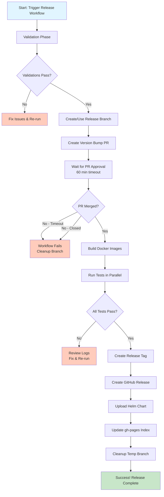

# Releasing

## Release Process

This release process covers the steps to release new major, minor, and patch versions for the Kyma Telemetry module using the automated release workflow.

Together with the module release, prepare a new release of the [opentelemetry-collector-components](https://github.com/kyma-project/opentelemetry-collector-components). You will need this later in the release process of the Telemetry Manager. The version of `opentelemetry-collector-components` will include the Telemetry Manager version as part of its version (`{CURRENT_OCC_VERSION}-{TELEMETRY_MANAGER_VERSION}`).

## Prerequisites

Before starting the release process, ensure:

1. All issues in the [GitHub milestone](https://github.com/kyma-project/telemetry-manager/milestones) related to the version are closed.
2. The milestone for the version is closed.
3. A new [GitHub milestone](https://github.com/kyma-project/telemetry-manager/milestones) for the next version is created.
4. The new version of [opentelemetry-collector-components](https://github.com/kyma-project/opentelemetry-collector-components) has been released.

## Automated Release Workflow

The Telemetry Manager uses an automated GitHub Actions workflow for releases. The workflow handles:

- Release branch creation (for major/minor releases)
- Version bumping and file updates
- Pull request creation for review
- Docker image building
- Comprehensive testing (unit, integration)
- GitHub release creation
- Helm chart packaging and publishing

### Workflow Modes

The release workflow supports three modes:

1. **Normal Mode** (default): Full release with all validations
2. **Dry Run Mode**: Test the release process without creating the actual release
3. **Force Mode**: Re-create an existing release (skips validation checks)

## Release Steps

### 1. Trigger the Release Workflow

Navigate to [Actions > Telemetry Release](https://github.com/kyma-project/telemetry-manager/actions/workflows/release.yml) and click **Run workflow**.

Provide the following inputs:

- **version**: The release version following the `x.y.z` pattern (e.g., `1.2.3`)
- **occ_image**: The OpenTelemetry Collector Components image version following the `x.y.z-a.b.c` pattern (e.g., `0.100.0-1.2.3`)
- **dry_run**: Set to `false` for actual release, `true` for testing
- **force**: Set to `false` (only use `true` to re-create an existing release)

**Example:**
```
version: 1.2.3
occ_image: 0.100.0-1.2.3
dry_run: false
force: false
```

### 2. Workflow Validation Phase

The workflow automatically performs the following validations:

- ✅ Verifies version format (`x.y.z`)
- ✅ Verifies OCC image format (`x.y.z-a.b.c`)
- ✅ Checks that the milestone exists and is closed
- ✅ Verifies the milestone has no open issues
- ✅ Checks that the release doesn't already exist
- ✅ Checks that the release tag doesn't already exist
- ✅ Determines if this is a patch release (existing release branch) or major/minor release (new release branch)

For **major/minor releases**, the workflow creates a new release branch `release-x.y` from `main`.

For **patch releases**, the workflow uses the existing release branch.

### 3. Version Bump Pull Request

The workflow automatically:

1. Creates a temporary branch `release-prep-{VERSION}` from the release branch
2. Updates the following in the `.env` file:
   - `ENV_HELM_RELEASE_VERSION`: Updated to the release version
   - `ENV_MANAGER_IMAGE`: Tag updated to the release version
   - `ENV_OTEL_COLLECTOR_IMAGE`: Tag updated to the OCC image version
3. Runs `make generate` to update generated files
4. Creates a pull request to the release branch with these changes

**Example PR:**
```
Title: Release preparation: Bump version to 1.2.3

Changes:
- Updated ENV_HELM_RELEASE_VERSION to 1.2.3
- Updated ENV_MANAGER_IMAGE tag to 1.2.3
- Updated ENV_OTEL_COLLECTOR_IMAGE tag to 0.100.0-1.2.3
- Ran make generate to update generated files
```

### 4. Review and Approve the Pull Request

**IMPORTANT**: The workflow pauses and waits for you to review and merge the PR.

1. Navigate to the automatically created pull request
2. Review the version changes:
   - ✅ Verify version numbers are correct
   - ✅ Verify generated files are up to date
   - ✅ Check for any unintended changes
3. Merge the pull request to continue the release workflow

**Timeout**: The workflow waits up to 60 minutes for the PR to be merged. If not merged within this time, the workflow fails.

### 5. Automated Testing and Building

After the PR is merged, the workflow automatically:

1. **Builds Docker Images**
   - Builds multi-architecture images (linux/amd64, linux/arm64)
   - Tags images with the release version

2. **Runs Tests** (in parallel)
   - Unit tests
   - PR integration tests
   - Gardener integration tests

3. **Uploads Release Report**
   - Collects and uploads test results for compliance

### 6. Release Creation

Once all tests pass, the workflow automatically:

1. Creates and pushes the release tag (`x.y.z`) on the release branch
2. Triggers the GitHub release creation using goreleaser
3. Packages the Helm chart
4. Uploads the Helm chart to the GitHub release
5. Updates the Helm repository index on the `gh-pages` branch

### 7. Verify the Release

1. Check the [workflow run status](https://github.com/kyma-project/telemetry-manager/actions/workflows/release.yml)
2. Verify the [GitHub release](https://github.com/kyma-project/telemetry-manager/releases)
3. Verify the Docker images are available:
   ```bash
   docker pull europe-docker.pkg.dev/kyma-project/prod/telemetry-manager:{VERSION}
   ```
4. Verify the Helm chart is available in the release assets

### 8. Post-Release Cleanup

The workflow automatically cleans up the temporary `release-prep-{VERSION}` branch after completion.

## Dry Run Mode (Recommended for Testing)

Before creating an actual release, you can test the entire process using dry run mode:

1. Run the workflow with `dry_run: true`
2. The workflow will:
   - ✅ Perform all validations
   - ✅ Create the PR for review
   - ✅ Build Docker images
   - ✅ Run all tests
   - ⏭️ Skip tag creation
   - ⏭️ Skip GitHub release creation
   - ⏭️ Skip Helm chart upload

3. Review the dry run summary in the workflow output
4. If everything looks good, re-run with `dry_run: false`

## Force Mode (Re-creating Releases)

If you need to re-create an existing release:

1. Run the workflow with `force: true`
2. The workflow will:
   - ⏭️ Skip version format validation
   - 🗑️ Delete the existing release (if it exists)
   - 🗑️ Delete the existing tag (if it exists)
   - ✅ Continue with normal release process

**Warning**: Use force mode with caution as it deletes existing releases and tags.

## Troubleshooting

### Workflow Fails During Validation

**Problem**: Version format is invalid, milestone is not closed, or release/tag already exists.

**Solution**:
- Fix the issue (close milestone, choose different version, etc.)
- Re-run the workflow

### Workflow Fails During Tests

**Problem**: Unit tests or integration tests fail.

**Solution**:
- Review the test failure logs
- Fix the issues in the codebase
- Push fixes to the release branch
- Re-run the workflow with `force: true` to re-create the release

### PR Not Merged in Time

**Problem**: The workflow times out after 60 minutes waiting for PR merge.

**Solution**:
- The workflow will fail and clean up the temporary branch
- Merge the PR manually (it will remain open)
- Re-run the workflow with `force: true`

### Need to Rollback a Release

If you need to rollback a release:

```bash
# Delete the GitHub release
gh release delete {VERSION} --yes

# Delete the release tag
git push origin :refs/tags/{VERSION}

# Revert changes on the release branch (if needed)
git checkout {RELEASE_BRANCH}
git revert HEAD
git push origin {RELEASE_BRANCH}
```

## Patch Releases (Bug Fixes)

For patch releases (e.g., `1.2.1` after `1.2.0`):

1. **Cherry-pick fixes** to the existing release branch:
   ```bash
   git checkout release-1.2
   git cherry-pick {COMMIT_SHA}
   git push origin release-1.2
   ```

2. **Run the release workflow** with the new patch version:
   ```
   version: 1.2.1
   occ_image: 0.100.0-1.2.1
   dry_run: false
   force: false
   ```

3. The workflow automatically detects the existing release branch and performs a patch release.

## Manual Release (Emergency)

If the automated workflow fails and you need to release manually, follow the legacy process:

1. Create/update the release branch manually
2. Update versions in `.env` manually
3. Run `make generate`
4. Create and push the tag manually
5. Monitor the `build-image.yml` and `tag-release.yml` workflows

See the legacy documentation for detailed manual steps.

## Changelog

Every PR's title must adhere to the [Conventional Commits](https://www.conventionalcommits.org/en/v1.0.0/) specification for an automatic changelog generation. It is enforced by a [semantic-pull-request](https://github.com/marketplace/actions/semantic-pull-request) GitHub Action.

### Pull Request Title

Due to the Squash merge GitHub Workflow, each PR results in a single commit after merging into the main development branch. The PR's title becomes the commit message and must adhere to the template:

`type(scope?): subject`

#### Type

- **feat**. A new feature or functionality change.
- **fix**. A bug or regression fix.
- **docs**. Changes regarding the documentation.
- **test**. The test suite alternations.
- **deps**. The changes in the external dependencies.
- **chore**. Anything not covered by the above categories (e.g., refactoring or artefacts building alternations).

Beware that PRs of type `chore` do not appear in the Changelog for the release. Therefore, exclude maintenance changes that are not interesting to consumers of the project by marking them with chore type:

- Dotfile changes (.gitignore, .github, and so forth).
- Changes to development-only dependencies.
- Minor code style changes.
- Formatting changes in documentation.

#### Subject

The subject must describe the change and follow the recommendations:

- Describe a change using the [imperative mood](https://en.wikipedia.org/wiki/Imperative_mood).  It must start with a present-tense verb, for example (but not limited to) Add, Document, Fix, Deprecate.
- Start with an uppercase, and not finish with a full stop.
- Kyma [capitalization](https://github.com/kyma-project/community/blob/main/docs/guidelines/content-guidelines/04-style-and-terminology.md#capitalization) and [terminology](https://github.com/kyma-project/community/blob/main/docs/guidelines/content-guidelines/04-style-and-terminology.md#terminology) guides.

## Release Workflow Summary



## Quick Reference

### Starting a Release

```bash
# Navigate to GitHub Actions
https://github.com/kyma-project/telemetry-manager/actions/workflows/release.yml

# Click "Run workflow" and provide:
version: x.y.z
occ_image: x.y.z-a.b.c
dry_run: false
force: false
```

### Testing Before Release

```bash
# Use dry run mode
dry_run: true
```

### Re-creating a Release

```bash
# Use force mode
force: true
```

### Checking Release Status

- **Workflow**: https://github.com/kyma-project/telemetry-manager/actions/workflows/release.yml
- **Releases**: https://github.com/kyma-project/telemetry-manager/releases
- **Docker Images**: europe-docker.pkg.dev/kyma-project/prod/telemetry-manager:{VERSION}